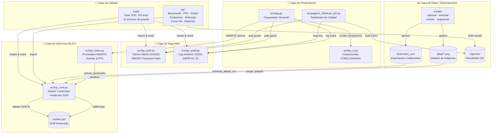
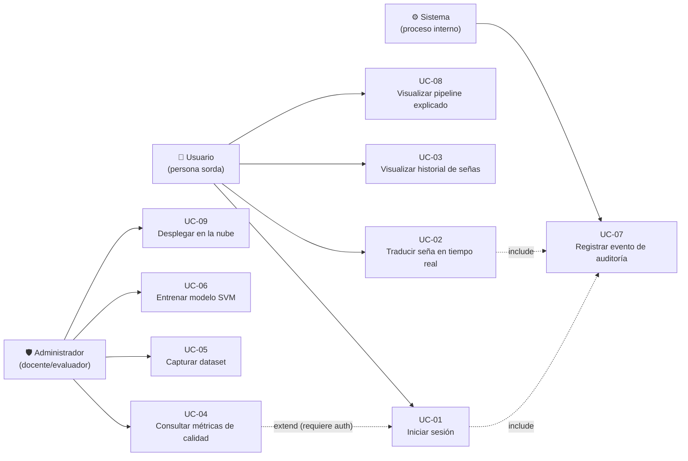
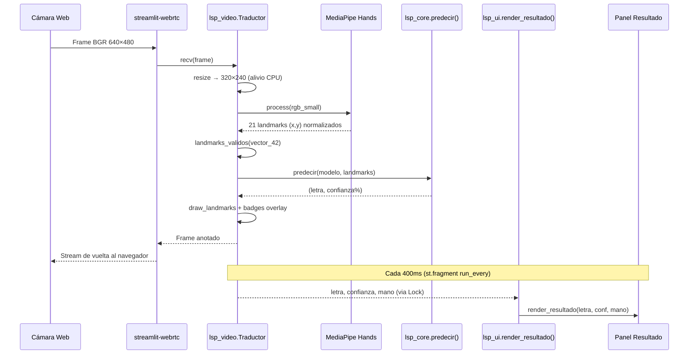

# Arquitectura del Sistema — LSP Vision AI
## Diagramas de Componentes y Casos de Uso
### Universidad Privada del Norte · Capstone Project Sistemas 2026
### Versión: 1.1 · Fecha: 2026-06-13

> Este documento cumple con **CA-02.1** (diagrama de componentes con 4 módulos principales),
> **CA-02.2** (≥7 casos de uso UC-01 a UC-07) y **CA-02.3** (tecnologías por módulo).

---

## 1. Diagrama de Componentes



---

## 2. Diagrama de Casos de Uso



---

## 3. Tecnologías por Módulo (CA-02.3)

| Módulo | Responsabilidad | Tecnologías |
|--------|-----------------|-------------|
| **src/app.py** | Orquestador: configura la página, inicializa WebRTC, guarda el estado | Streamlit, streamlit-webrtc |
| **src/lsp_video.py** | Captura de video: procesa frames, dibuja overlay, mide FPS | OpenCV 4.11.0, MediaPipe 0.10.21, PyAV, threading |
| **src/lsp_core.py** | Núcleo ML/CV: carga modelo, extrae landmarks, predice, carga dataset | MediaPipe Hands, scikit-learn 1.9.0 SVM, NumPy 1.26.4, joblib |
| **src/lsp_auth.py** | Autenticación: hashea contraseñas, genera/verifica tokens HMAC | hashlib (PBKDF2-SHA256), hmac, secrets (stdlib) |
| **src/lsp_audit.py** | Auditoría: escribe/lee/purga log JSON Lines anónimo | json, datetime (stdlib) |
| **src/lsp_ui.py** | Interfaz: HTML, CSS con correcciones WCAG, ARIA, skip-nav | Streamlit HTML unsafe, CSS3, ARIA 1.1 |
| **src/pages/1_Metricas_QA.py** | Dashboard: métricas del modelo, recursos en vivo, log de auditoría | Streamlit, psutil, csv, json (stdlib) |
| **scripts/** | Captura de dataset, entrenamiento, extracción de landmarks, augmentación | OpenCV, MediaPipe, scikit-learn, NumPy |
| **qa/** | Suite de calidad: latencia, FPS, estrés, robustez, confusión, cross-val | scikit-learn, NumPy, matplotlib, psutil |
| **tests/** | Suite TDD: unitarios, integración, sistema, seguridad, ética | pytest, pytest-cov, unittest.mock |
| **Dockerfile** | Contenedorización para despliegue reproducible | Docker, python:3.12-slim |
| **config/** | Configuración dev: linters, cobertura, dependencias dev, scanner seguridad | setup.cfg, pyproject.toml, trivy.yaml |

---

## 4. Flujo de Datos del Pipeline de Inferencia



---

## 5. Estructura de Carpetas

```
c:\Traductor-Senas-IA\
├── src/                          # Código fuente principal (pythonpath)
│   ├── app.py                    # Punto de entrada Streamlit
│   ├── lsp_core.py               # Núcleo ML/CV (testeable, sin UI)
│   ├── lsp_video.py              # Procesador WebRTC
│   ├── lsp_auth.py               # Autenticación HMAC
│   ├── lsp_audit.py              # Log de auditoría
│   ├── lsp_ui.py                 # Componentes HTML/CSS/ARIA
│   └── pages/
│       └── 1_Metricas_QA.py      # Dashboard de métricas
├── tests/                        # Suite TDD (143 tests, 11 archivos)
│   ├── conftest.py               # Fixtures compartidas
│   ├── test_audit.py             # Tests de auditoría
│   ├── test_auth.py              # Tests de autenticación
│   ├── test_errores.py           # Tests de manejo de errores
│   ├── test_etica.py             # Tests de ética e imparcialidad
│   ├── test_integracion.py       # Tests de integración
│   ├── test_landmarks.py         # Tests de extracción de landmarks
│   ├── test_modelo.py            # Tests del clasificador SVM
│   ├── test_seguridad.py         # Tests DevSecOps (OWASP)
│   ├── test_sistema.py           # Tests end-to-end
│   ├── test_validacion.py        # Tests de validación de entrada
│   └── test_video.py             # Tests del procesador de video
├── qa/                           # Scripts de calidad (11 archivos)
│   ├── benchmark.py              # Latencia de predicción
│   ├── confusion_matrix.py       # Matriz de confusión
│   ├── cross_validation.py       # Validación cruzada k-fold
│   ├── evaluate.py               # Evaluación del modelo
│   ├── fps_test.py               # Prueba de FPS
│   ├── generar_reportes.py       # Reporte consolidado
│   ├── recursos.py               # Monitoreo CPU/RAM
│   ├── robustez.py               # Prueba de robustez
│   └── stress_test.py            # Prueba de estrés
├── scripts/                      # Scripts de ciclo de vida del dataset
│   ├── capturar_dataset.py       # Captura de imágenes por letra
│   ├── extraer_landmarks.py      # Extracción de landmarks a CSV
│   ├── augmentar_dataset.py      # Aumentación de datos
│   ├── entrenar_modelo.py        # Entrenamiento desde imágenes
│   └── entrenar_desde_csv.py     # Entrenamiento desde CSV colaborativo
├── config/                       # Configuración de herramientas dev
│   ├── setup.cfg                 # Configuración pytest/coverage
│   ├── trivy.yaml                # Scanner de vulnerabilidades
│   └── requirements-dev.txt      # Dependencias de desarrollo
├── data/                         # Dataset: data/<letra>/*.png
├── reportes/                     # Resultados QA (CSV, PNG, JSON)
├── docs/
│   ├── arquitectura/
│   │   ├── COMPONENTES.md        # Este archivo (CA-02.1/02.2/02.3)
│   │   ├── MODELO_DATOS.md       # Modelo de datos incremental por sprint
│   │   └── MANUAL_BASE_DE_DATOS.md # Diccionario, pipelines, calidad y privacidad
│   ├── gestion_agil/
│   │   ├── requerimientos.md     # 15 RF + 15 RNF (CA-01.1)
│   │   ├── HISTORIAS_USUARIO.md  # HUs con criterios Gherkin
│   │   ├── DEFINITION_OF_DONE.md # Criterios DoD por dimensión
│   │   ├── MATRIZ_TRAZABILIDAD.md# Función → HU → CA → Test
│   │   ├── SPRINT_BACKLOG.md     # Backlog por sprint
│   │   └── BURNDOWN_CHART.md     # Gráfico de quemado
│   ├── qa_y_pruebas/
│   │   ├── GUIA_QA.md            # Guía de calidad
│   │   ├── GUIA_RECAPTURA_DATASET.md
│   │   ├── INCIDENTES.md         # Registro de incidentes
│   │   └── plantilla_UAT.md      # Plantilla pruebas de aceptación
│   ├── seguridad_y_etica/
│   │   ├── SEGURIDAD.md          # Plan DevSecOps
│   │   └── IA_ETICA.md           # Ética e imparcialidad del modelo
│   ├── usuario_y_tutoriales/
│   │   ├── MANUAL_USUARIO.md     # Manual de usuario final
│   │   ├── TUTORIAL_DESPLIEGUE_WEB.md
│   │   ├── TUTORIAL_EQUIPO.md
│   │   └── TUTORIAL_HUGGINGFACE.md
│   └── cierre/
│       └── LECCIONES_APRENDIDAS.md
├── pyproject.toml                # Configuración Black, Pylint, pytest
├── requirements.txt              # Dependencias de producción
├── Dockerfile                    # Imagen python:3.12-slim
├── Makefile                      # Comandos de desarrollo
└── modelo.pkl                    # Clasificador SVM entrenado
```

---

## Historial de Versiones

| Versión | Fecha | Cambio |
|---------|-------|--------|
| 1.0 | 2026-06-12 | Versión inicial — diagramas Mermaid, tecnologías, flujo de datos |
| 1.1 | 2026-06-13 | Actualizar rutas a src/, conteo de tests (143), carpetas scripts/ y config/, docs reorganizados en subcarpetas temáticas |
