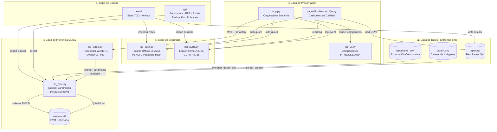
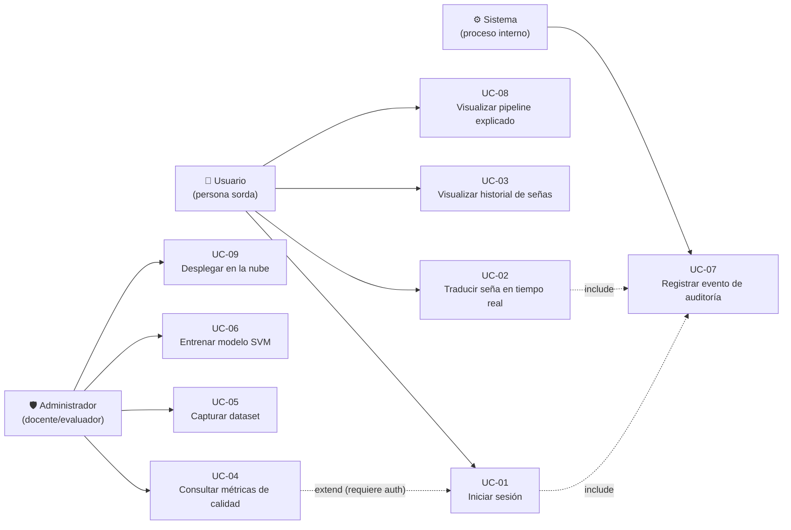
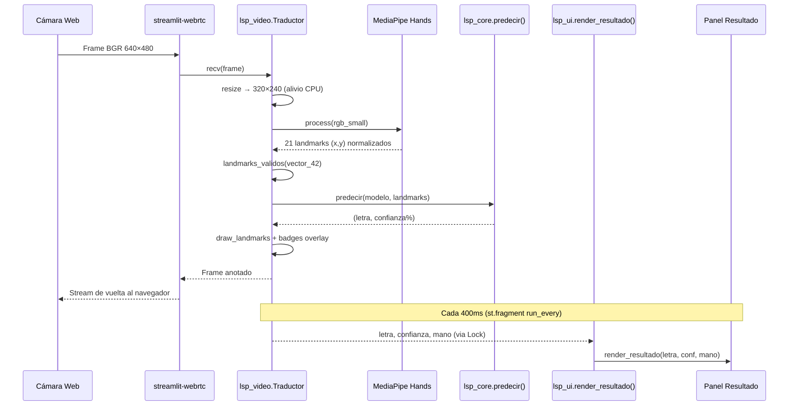

# Arquitectura del Sistema — LSP Vision AI
## Diagramas de Componentes y Casos de Uso
### Universidad Privada del Norte · Capstone Project Sistemas 2026

> Este documento cumple con **CA-02.1** (diagrama de componentes con 4 módulos principales),
> **CA-02.2** (≥7 casos de uso UC-01 a UC-07) y **CA-02.3** (tecnologías por módulo).

---

## 1. Diagrama de Componentes



---

## 2. Diagrama de Casos de Uso



---

## 3. Tecnologías por Módulo (CA-02.3)

| Módulo | Responsabilidad | Tecnologías |
|--------|-----------------|-------------|
| **app.py** | Orquestador: configura la página, inicializa WebRTC, guarda el estado | Streamlit 1.x, streamlit-webrtc |
| **lsp_video.py** | Captura de video: procesa frames, dibuja overlay, mide FPS | OpenCV 4.11, MediaPipe 0.10, PyAV, threading |
| **lsp_core.py** | Núcleo ML/CV: carga modelo, extrae landmarks, predice, carga dataset | MediaPipe Hands, scikit-learn SVM, NumPy, joblib |
| **lsp_auth.py** | Autenticación: hashea contraseñas, genera/verifica tokens HMAC | hashlib (PBKDF2-SHA256), hmac, secrets (stdlib) |
| **lsp_audit.py** | Auditoría: escribe/lee/purga log JSON Lines anónimo | json, datetime (stdlib) |
| **lsp_ui.py** | Interfaz: HTML, CSS con correcciones WCAG, ARIA, skip-nav | Streamlit HTML unsafe, CSS3, ARIA 1.1 |
| **pages/1_Metricas_QA.py** | Dashboard: métricas del modelo, recursos en vivo, log de auditoría | Streamlit, psutil, csv, json (stdlib) |
| **qa/** | Suite de calidad: latencia, FPS, estrés, robustez, confusión | scikit-learn, NumPy, matplotlib, psutil |
| **tests/** | Suite TDD: unitarios, integración, sistema | pytest, pytest-cov, unittest.mock |
| **Dockerfile** | Contenedorización para despliegue reproducible | Docker, python:3.12-slim |

---

## 4. Flujo de Datos del Pipeline de Inferencia



---

## 5. Estructura de Carpetas

```
c:\Traductor-Senas-IA\
├── app.py                    # Punto de entrada Streamlit
├── lsp_core.py               # Núcleo ML/CV (testeable, sin UI)
├── lsp_video.py              # Procesador WebRTC
├── lsp_auth.py               # Autenticación HMAC
├── lsp_audit.py              # Log de auditoría
├── lsp_ui.py                 # Componentes HTML/CSS/ARIA
├── pages/
│   └── 1_Metricas_QA.py      # Dashboard de métricas
├── tests/                    # Suite TDD (49 tests)
├── qa/                       # Scripts de calidad (10 scripts)
├── data/                     # Dataset: data/<letra>/*.png
├── landmarks_csv/            # Exportaciones CSV colaborativas
├── reportes/                 # Resultados QA (CSV, PNG, JSON)
├── docs/
│   ├── requerimientos.md     # 15 RF + 15 RNF (CA-01.1)
│   └── arquitectura/
│       ├── COMPONENTES.md    # Este archivo (CA-02.1/02.2/02.3)
│       └── MODELO_DATOS.md   # Modelo de datos incremental
├── HISTORIAS_USUARIO.md      # 22 HUs con criterios Gherkin
├── DEFINITION_OF_DONE.md     # Criterios DoD por dimensión
├── MATRIZ_TRAZABILIDAD.md    # Función → HU → CA → Test
└── modelo.pkl                # Clasificador SVM entrenado
```

---

## Historial de Versiones

| Versión | Fecha | Cambio |
|---------|-------|--------|
| 1.0 | 2026-06-12 | Versión inicial — diagramas Mermaid, tecnologías, flujo de datos |
