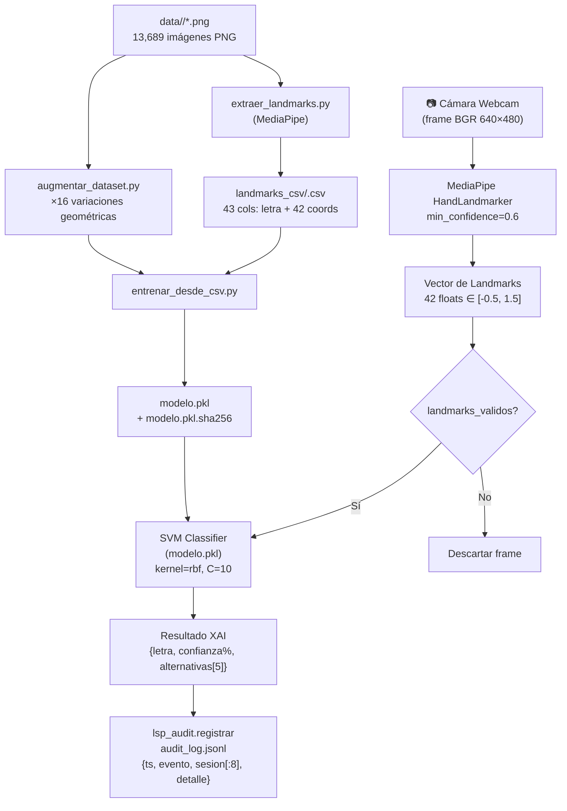

# Manual de Base de Datos — LSP Vision AI
## Universidad Privada del Norte · Capstone Project Sistemas 2026
### Autor: Equipo LSP Vision AI (7 integrantes) · Versión: 1.1 · 2026-06-21

> Este documento describe el ecosistema de datos del sistema: inventario, diccionario de datos,
> pipelines de procesamiento, calidad, privacidad y procedimientos operativos.
> Para la descripción técnica de estructuras por sprint, ver [`MODELO_DATOS.md`](MODELO_DATOS.md).

---

## 1. Visión General

LSP Vision AI no usa una base de datos relacional tradicional. El almacenamiento está basado
en **archivos estructurados** con responsabilidades bien delimitadas:

| Capa | Tecnología | Persistencia |
|---|---|---|
| Dataset de imágenes | Carpetas PNG en `data/` | Git (rastreado) |
| Modelo entrenado | `modelo.pkl` (joblib) | Git LFS |
| CSV colaborativos | `landmarks_csv/*.csv` | Local (excluido de git) |
| Log de auditoría | `audit_log.jsonl` | Local / efímero en cloud |
| Métricas QA | `reportes/*.csv`, `*.json` | Git (rastreado) |
| Estado en tiempo real | Atributos de clase en RAM | En memoria — no persiste |

---

## 2. Diagrama de Entidades y Relaciones



---

## 3. Inventario de Entidades de Datos

### 3.1 Dataset de Imágenes (`data/`)

| Atributo | Valor |
|---|---|
| Ubicación | `data/<letra>/<letra>_<índice>.png` |
| Total de imágenes | 13,689 archivos PNG |
| Carpetas | 26 (a–z en minúscula) |
| Formato | PNG, color RGB/BGR |
| Resolución | Variable (webcam, típicamente 640×480 px) |
| Convención de nombre | `<letra>_<índice_autoincremental>.png` |
| Rastreado en git | ✅ Sí |

**Distribución por letra:**

| Letra | Imágenes | Estado de detección |
|---|---|---|
| A | ~500 | ✅ Normal |
| B | ~545 | ✅ Normal |
| C | ~500 | ✅ Normal |
| D | ~509 | ⚠️ Bajo (1.8% detección con Tasks API) |
| E | ~509 | ✅ Normal |
| F | ~509 | ⚠️ Bajo (13.7% detección) |
| G–H | ~500–509 | ✅ Normal |
| I | ~509 | ⚠️ Bajo (18.9% detección) |
| J | ~509 | ⚠️ Muy bajo (0.8% — seña dinámica) |
| K–N | ~500–509 | ✅ Normal |
| O | ~500 | ❌ Crítico (0% detección — puño cerrado) |
| P–R | ~509 | ✅ Normal |
| S | ~500 | ⚠️ Bajo (5.8% detección — similar a A) |
| T–Z | ~509–1000 | ✅ Normal (Q tiene ~1000 por recaptura) |

> Ver `docs/qa_y_pruebas/GUIA_RECAPTURA_DATASET.md` para el plan de mejora de letras críticas.

---

### 3.2 Vector de Landmarks (en memoria)

| Atributo | Valor |
|---|---|
| Dimensión | 42 floats |
| Codificación | `[x0, y0, x1, y1, ..., x20, y20]` — 21 puntos MediaPipe |
| Rango válido | `[-0.5, 1.5]` (margen para manos parcialmente fuera de cuadro) |
| Normalización | Relativa al bounding box de la mano, no al frame completo |
| Persistencia | **No persiste** — procesado en RAM, descartado tras predicción (GDPR) |
| Función de validación | `lsp_core.landmarks_validos()` en `src/lsp_core.py` |

**Mapa de puntos anatómicos (NOMBRES_LANDMARKS):**

| Índice | Nombre | Índice | Nombre |
|---|---|---|---|
| 0 | Muñeca | 11 | Falange medio |
| 1 | Base pulgar | 12 | Punta medio |
| 2 | Nudillo pulgar | 13 | Base anular |
| 3 | Falange pulgar | 14 | Nudillo anular |
| 4 | Punta pulgar | 15 | Falange anular |
| 5 | Base índice | 16 | Punta anular |
| 6 | Nudillo índice | 17 | Base meñique |
| 7 | Falange índice | 18 | Nudillo meñique |
| 8 | Punta índice | 19 | Falange meñique |
| 9 | Base medio | 20 | Punta meñique |
| 10 | Nudillo medio | | |

---

### 3.3 CSV Colaborativos (`landmarks_csv/`)

| Atributo | Valor |
|---|---|
| Ubicación | `landmarks_csv/<nombre>.csv` — **carpeta local, excluida de git** |
| Número de archivos esperados | 7 (uno por integrante del equipo) |
| Columnas | 43: `letra, x0, y0, x1, y1, ..., x20, y20` |
| Tipo de datos | `letra`: str (a–z); coordenadas: float64 normalizado [0, 1] |
| Tamaño aproximado | Unos KB por persona (~13,000 filas × 43 cols) |
| Codificación de archivo | UTF-8 sin BOM |
| Separador | Coma (`,`) |
| Generado por | `scripts/extraer_landmarks.py` o `scripts/COMPANEROS_extraer_landmarks.bat` |

**Archivos esperados del equipo:**

| Archivo | Integrante |
|---|---|
| `landmarks_andrea.csv` | Acosta Abarca, Andrea Karina Alessandra |
| `landmarks_sebastian.csv` | Angulo López, Sebastian |
| `landmarks_deyvis.csv` | Armas Alvarado, Jose Deyvis |
| `landmarks_nicolas.csv` | Arias Chauca, Nicolas Enrry |
| `landmarks_oscar_m.csv` | Reategui Arevalo, Oscar Manuel |
| `landmarks_oscar.csv` | Rodriguez Chacara, Oscar Daniel |
| `landmarks_santiago.csv` | Timana Barreda, Santiago Mathias |

---

### 3.4 Modelo SVM (`modelo.pkl`)

| Atributo | Valor |
|---|---|
| Ubicación | `modelo.pkl` (raíz del proyecto) |
| Formato de serialización | joblib (no pickle nativo) |
| Tipo de modelo | `sklearn.svm.SVC` |
| Hiperparámetros | `kernel='rbf'`, `C=10`, `gamma='scale'`, `probability=True` |
| Clases | 25 letras (a–z, excluyendo la o — sin detección válida, ver INC-12) |
| Dimensión de entrada | 42 features |
| Dataset de entrenamiento | 9,585 muestras reales → ~153,360 tras augmentation (×16) |
| Accuracy | 100% sobre el dataset de entrenamiento completo (sin held-out test set independiente — `qa/evaluate.py`, resultado optimista). Cross-validation K-Fold no factible: la clase J solo tiene 3 muestras (< k=5) |
| Tamaño en disco | ~642 KB |
| Verificación de integridad | `modelo.pkl.sha256` — SHA-256 de 64 chars |
| Rastreado en git | ✅ Sí (via Git LFS) |

---

### 3.5 Log de Auditoría (`audit_log.jsonl`)

| Atributo | Valor |
|---|---|
| Ubicación | `audit_log.jsonl` (raíz del proyecto) |
| Formato | JSON Lines (un objeto JSON por línea) |
| Rastreado en git | ❌ No (excluido por `.gitignore`) |
| Persistencia en cloud | Efímero — filesystem volátil de HuggingFace Spaces |
| Retención | 7 días — `lsp_audit.purgar_log_antiguo(dias=7)` |

**Esquema de una entrada:**

| Campo | Tipo | Descripción | Ejemplo |
|---|---|---|---|
| `ts` | `str` ISO 8601 | Timestamp del evento (segundos) | `"2026-06-16T10:32:17"` |
| `evento` | `str` | Tipo de evento (ver tabla) | `"LOGIN_OK"` |
| `sesion` | `str` 8 hex | SHA-256[:8] del token — no reversible | `"a3f8c2b1"` |
| `detalle` | `str` | Contexto adicional sin datos personales | `""` |

**Catálogo de eventos:**

| Evento | Origen | Descripción |
|---|---|---|
| `LOGIN_OK` | `lsp_auth` | Autenticación exitosa |
| `LOGIN_FAIL` | `lsp_auth` | Clave incorrecta ingresada |
| `SESION_EXPIRADA` | `lsp_auth` | Token de sesión vencido (>60 min) |
| `PAGINA_VISITADA` | `app.py` | Primera carga de la página principal |
| `TRADUCCION_INICIADA` | `app.py` | Usuario activa la cámara WebRTC |
| `TRADUCCION_DETENIDA` | `app.py` | Usuario detiene la cámara WebRTC |

---

### 3.6 Reportes QA (`reportes/`)

| Archivo | Formato | Columnas / Contenido |
|---|---|---|
| `metricas.json` | JSON | `muestras`, `clases`, `accuracy`, `precision_macro`, `recall_macro`, `f1_macro`, `timestamp` |
| `metricas_por_clase.csv` | CSV | `letra`, `precision`, `recall`, `f1`, `support` |
| `metricas_resumen.csv` | CSV | Fila única con métricas globales |
| `benchmark.csv` | CSV | `etapa`, `promedio_ms`, `minimo_ms`, `maximo_ms`, `desv_std_ms` |
| `fps.csv` | CSV | `frames_totales`, `fps_promedio`, `fps_maximo`, `fps_minimo` |
| `cross_validation.csv` | CSV | `k`, `accuracy_media`, `desv_std`, `nota` |
| `matriz_confusion.csv` | CSV | Matriz N×N (filas=real, cols=predicho) |
| `matriz_confusion.png` | PNG | Heatmap de la matriz de confusión (560 px) |
| `robustez.csv` | CSV | `condicion`, `detectadas`, `total`, `tasa_deteccion_pct` |
| `recursos.csv` | CSV | `ram_mb`, `cpu_pct` (consumo durante QA) |
| `stress.csv` | CSV | `predicciones`, `errores`, `promedio_ms`, `delta_memoria_mb`, `estado` |

**Métricas actuales (2026-06-14):**
- Accuracy: 100% · Precision macro: 100% · Recall macro: 100% · F1 macro: 100% — medido sobre el dataset de entrenamiento completo (no un test set reservado); ver nota en §3.4
- Latencia pipeline completo: 24.48 ms promedio (MediaPipe: 23.91 ms + SVM: 0.22 ms)
- FPS promedio: 82.7 · Rango: 15–89 FPS

---

## 4. Pipelines de Datos

### Pipeline A — Desde imágenes a modelo (entrenamiento completo)

```
scripts/capturar_dataset.py
  │  ↳ Captura frames de webcam filtrados por MediaPipe (confianza ≥ 0.6)
  │  ↳ Guarda data/<letra>/<letra>_N.png (índice autoincremental)
  ▼
scripts/augmentar_dataset.py
  │  ↳ Lee todas las imágenes de data/
  │  ↳ Extrae vector 42-d por imagen via MediaPipe
  │  ↳ Genera 15 variaciones geométricas por vector:
  │     - Rotación: ±5°, ±10°, ±15° (6 versiones)
  │     - Escala: ×0.88, ×0.94, ×1.06, ×1.12 (4 versiones)
  │     - Ruido gaussiano σ=0.006 × 3 semillas (3 versiones)
  │     - Rotación+ruido combinados (2 versiones)
  │  ↳ Total: 9,585 reales → ~153,360 tras augmentation
  ▼
sklearn.svm.SVC.fit(X, y)
  │  ↳ Entrenamiento SVM en < 3 segundos sin GPU
  ▼
modelo.pkl  +  modelo.pkl.sha256

Acceso rápido: scripts/5_AUGMENTAR_y_ENTRENAR.bat
```

### Pipeline B — Desde CSVs colaborativos (entrenamiento distribuido)

```
landmarks_csv/
├── landmarks_andrea.csv
├── landmarks_sebastian.csv
├── ...  (7 archivos del equipo)
└── landmarks_santiago.csv
  ▼
scripts/entrenar_desde_csv.py
  │  ↳ Lee y concatena todos los CSV
  │  ↳ X shape: (N_total × 42),  y shape: (N_total,)
  ▼
sklearn.svm.SVC.fit(X, y)
  ▼
modelo.pkl  +  modelo.pkl.sha256

Acceso rápido: scripts/4_ENTRENAR_desde_CSV.bat
```

### Pipeline C — Inferencia en tiempo real (producción)

```
Webcam → av.VideoFrame (WebRTC)
  ↓
lsp_video.Traductor.recv()
  ↓
BGR 640×480 → resize RGB 320×240
  ↓
MediaPipe HandLandmarker.detect_for_video()
  ↓
landmarks_validos() ← descarta vectores inválidos
  ↓
lsp_core.explicar_prediccion(modelo, vector, top_n=5)
  ↓
{letra, confianza%, alternativas[5], n_clases}
  ↓
UI Streamlit + registro opcional en audit_log.jsonl
```

---

## 5. Calidad e Integridad de Datos

### Reglas de validación activas

| Regla | Código | Descripción |
|---|---|---|
| Dimensión correcta | `landmarks_validos()` | Vector debe tener exactamente 42 elementos |
| Sin NaN/Inf | `landmarks_validos()` | Todos los valores deben ser finitos |
| Rango válido | `landmarks_validos()` | Todos en `[-0.5, 1.5]` |
| Detección mínima | `capturar_dataset.py` | MediaPipe confianza ≥ 0.6; frames sin mano se descartan |
| Integridad del modelo | `verificar_integridad_modelo()` | SHA-256 de `modelo.pkl` comparado con `modelo.pkl.sha256` |
| Índice no sobreescrito | `capturar_dataset.py` | Imágenes nuevas usan índice autoincremental |

### Letras con calidad crítica (requieren recaptura)

| Letra | Razón | Tasa de detección |
|---|---|---|
| O | Puño completamente cerrado — MediaPipe no detecta landmarks | 0% |
| J | Seña dinámica (movimiento) — sistema solo detecta estáticas | 0.8% |
| D | Índice extendido con puño — ambigüedad geométrica | 1.8% |
| S | Puño similar a A — confusión de clase | 5.8% |
| F | Posición de dedos atípica | 13.7% |
| I | Solo meñique extendido | 18.9% |

---

## 6. Privacidad y Cumplimiento (GDPR Art. 25)

| Principio | Implementación |
|---|---|
| **Minimización de datos** | Solo se procesan 42 coordenadas de mano; ningún frame de video se almacena en disco |
| **Consentimiento informado** | Cada integrante captura sus propias señas voluntariamente — no se capturan imágenes de terceros |
| **Derecho de supresión** | Opción "Reemplazar" en `capturar_dataset.py` elimina muestras de una letra |
| **Anonimización en logs** | El campo `sesion` es SHA-256[:8] del token — no reversible a identidad de usuario |
| **Sin persistencia biométrica** | Los landmarks no se guardan en el log de auditoría (`test_log_no_almacena_landmarks_biometricos`) |
| **Efemeralidad en cloud** | `audit_log.jsonl` es volátil en HuggingFace Spaces; en local se purga a los 7 días |

---

## 7. Procedimientos Operativos

### Añadir datos de un nuevo integrante

1. El integrante ejecuta `scripts/COMPANEROS_extraer_landmarks.bat` en su equipo.
2. Envía su archivo `landmarks_<nombre>.csv` al encargado de dataset (por Drive, correo, etc.).
3. El encargado copia el CSV a la carpeta local `landmarks_csv/`.
4. Ejecutar `scripts/4_ENTRENAR_desde_CSV.bat` para reentrenar el modelo.
5. Verificar: `python -m pytest tests/ -q` debe seguir en verde (143 tests PASS).
6. Subir el nuevo `modelo.pkl` al repositorio: `git add modelo.pkl && git commit`.

### Reentrenar desde cero (imágenes)

```bash
# Opción A: augmentation + entrenamiento completo
scripts/5_AUGMENTAR_y_ENTRENAR.bat

# Opción B: solo entrenamiento sin augmentación
python -m scripts.entrenar_desde_csv
```

### Respaldar datos críticos

| Dato | Estrategia |
|---|---|
| `modelo.pkl` | Almacenado en git (LFS) — cada push es un respaldo versionado |
| `data/` | Almacenado en git — 13,689 imágenes versionadas |
| `reportes/` | Almacenados en git — regenerables con `make qa` |
| `landmarks_csv/` | **No está en git** — respaldar en Drive compartido del equipo |
| `audit_log.jsonl` | No respaldado — datos de monitoreo operativo no críticos |

### Verificar integridad del modelo

```python
from src.lsp_core import verificar_integridad_modelo
ok = verificar_integridad_modelo("modelo.pkl")
# True → modelo íntegro; False → posible manipulación, no cargar
```

---

## 8. Limitaciones Conocidas del Modelo (SESGOS_CONOCIDOS)

| Sesgo | Descripción |
|---|---|
| Diversidad de entrenamiento | Modelo entrenado con datos de 4 personas del equipo UPN (Trujillo, Perú); no las 7 del equipo total — ver `SESGOS_CONOCIDOS` en `lsp_core.py` |
| Letra no soportada | La letra O no es reconocible (0% detección, puño cerrado — INC-12). **Nota:** el comentario `letras_dinamicas` en el código (`lsp_core.py`) aún describe J/Z como "no soportadas por movimiento", pero ambas SÍ están entrenadas como clases estáticas en el modelo actual (J con solo 3 muestras); ese comentario está desactualizado y debe revisarse en el código |
| Iluminación | Rendimiento se degrada con iluminación insuficiente o contraluz |
| Letras similares | Confusiones conocidas: A/S/E, B/F, G/Q — ver `matriz_confusion.csv` |
| Sesgo de datos | Algunas letras tienen menor representación en el dataset |

---

## 9. Historial de Versiones

| Versión | Fecha | Cambio |
|---|---|---|
| 1.0 | 2026-06-16 | Documento inicial — inventario completo de entidades, diccionarios, pipelines, calidad y privacidad |
| 1.1 | 2026-06-21 | Corrección: accuracy 100% aclarado como medido sobre dataset completo (sin test set reservado, sin K-Fold posible); exclusión real es la letra O (no "letras dinámicas"); 4 personas en el dataset (no 7); `detect_async()` → `detect_for_video()` |

---

*Manual de Base de Datos v1.1 · LSP Vision AI · UPN Ingeniería de Sistemas 2026*
*Complementa: [`MODELO_DATOS.md`](MODELO_DATOS.md) (estructuras técnicas por sprint)*
