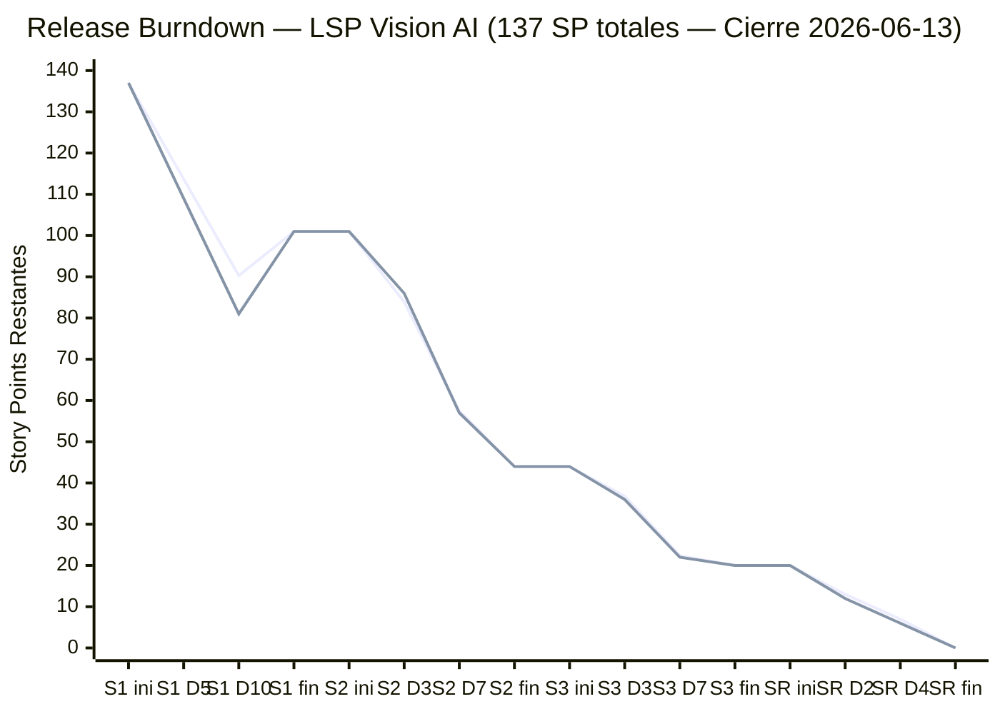
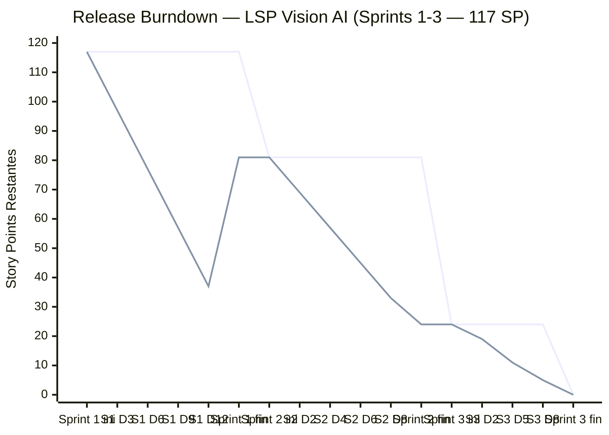
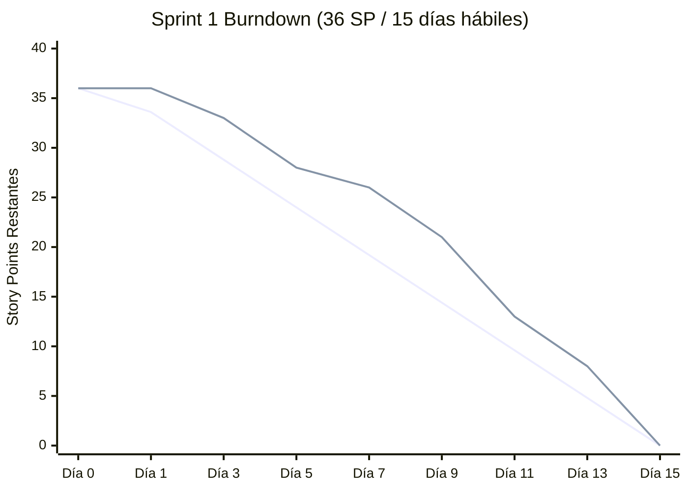
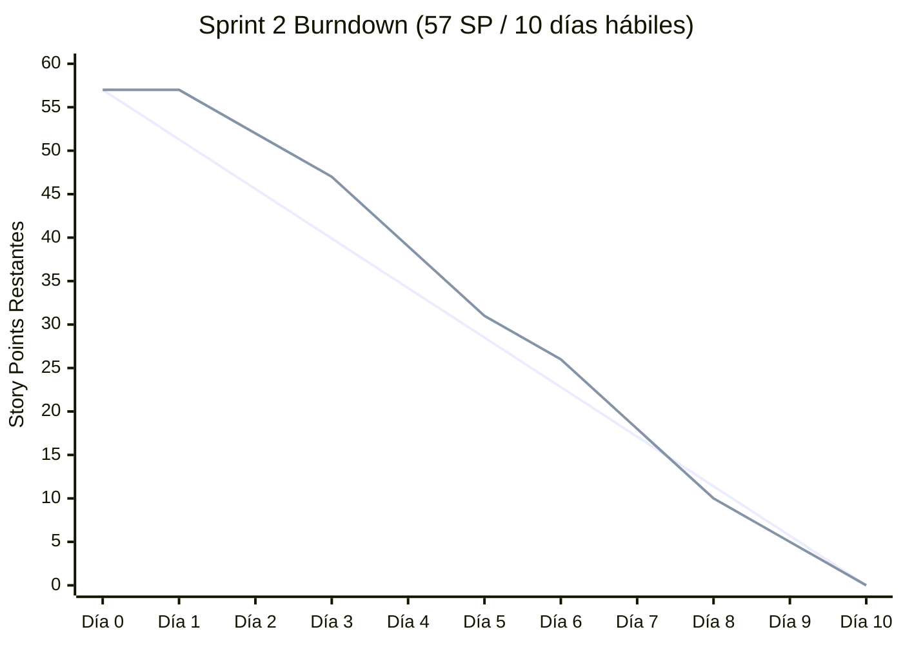
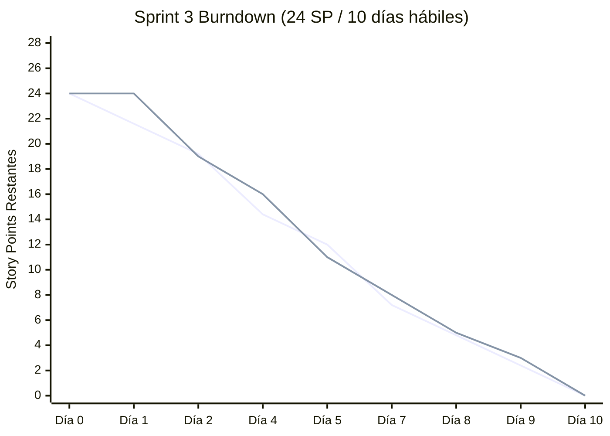
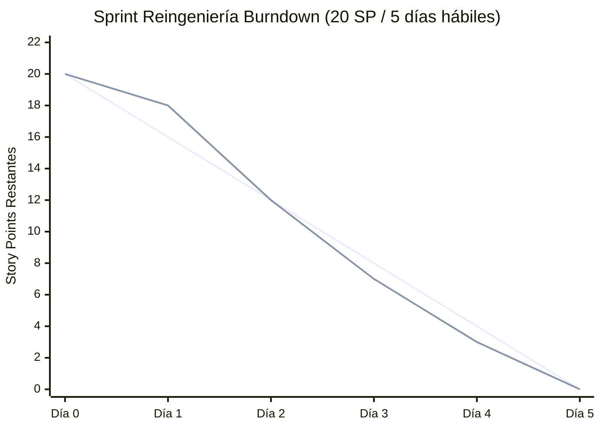

# Burndown Charts — LSP Vision AI
## Universidad Privada del Norte · Capstone Project Sistemas 2026
### Autor: Rodriguez Chacara, Oscar Daniel
### Versión: 2.1 · 2026-06-13 · **Estado: PROYECTO CERRADO — Línea real llegó a 0 SP**

Los siguientes gráficos muestran el avance del equipo en cada Sprint, comparando
el trabajo **ideal** (línea recta) contra el trabajo **real** completado.

- **Eje Y:** Story Points (SP) restantes
- **Eje X:** Días hábiles del Sprint
- Una curva real **por debajo** de la ideal indica adelanto; **por encima**, retraso.
- **La línea real de todos los sprints alcanzó 0 SP al finalizar el plazo.** Ver retrospectivas.

---

## Resumen del Product Backlog

| Sprint | Historias | Story Points | Duración | Estado |
|--------|-----------|-------------|----------|--------|
| Sprint 1 | HU-01 … HU-07 | 36 SP | 15 días hábiles | ✅ Cerrado |
| Sprint 2 | HU-08 … HU-14, HU-17, HU-18, HU-22 | 57 SP | 10 días hábiles | ✅ Cerrado |
| Sprint 3 | HU-15, HU-16, HU-19, HU-20, HU-21 | 24 SP | 10 días hábiles | ✅ Cerrado |
| Sprint Reingeniería | TR-01..TR-13 | 20 SP | 5 días hábiles | ✅ Cerrado |
| **Total** | **22 HUs + Reingeniería** | **137 SP** | **40 días hábiles** | **✅ 100%** |

### Story Points por Historia

| HU | Descripción | SP |
|----|-------------|-----|
| HU-01 | Definición de requerimientos y alcance | 3 |
| HU-02 | Arquitectura modular del sistema | 5 |
| HU-03 | Configuración del entorno y repositorio | 2 |
| HU-04 | Recolección inicial del dataset LSP | 5 |
| HU-05 | Construcción completa del dataset LSP | 8 |
| HU-06 | Extracción de landmarks y preprocesamiento | 5 |
| HU-07 | Entrenamiento y validación del SVM | 8 |
| HU-08 | Captura de video en tiempo real | 5 |
| HU-09 | Detección de manos con MediaPipe | 5 |
| HU-10 | Reconocimiento y traducción en tiempo real | 8 |
| HU-11 | Historial de señas y construcción de texto | 3 |
| HU-12 | Integración completa de módulos | 5 |
| HU-13 | Acceso controlado (clave de sesión) | 8 |
| HU-14 | Registro anónimo de accesos (auditoría) | 5 |
| HU-15 | Interfaz accesible WCAG 2.1 AA | 5 |
| HU-16 | Explicación transparente del sistema de IA | 3 |
| HU-17 | Dashboard de métricas de calidad | 5 |
| HU-18 | Pruebas unitarias automatizadas | 8 |
| HU-19 | Pruebas de aceptación con usuarios finales | 5 |
| HU-20 | Validación de privacidad y protección de datos | 3 |
| HU-21 | Despliegue del sistema | 8 |
| HU-22 | Pruebas de rendimiento, carga y estrés | 5 |

---

## Release Burndown (Proyecto completo — incluyendo Sprint de Reingeniería)



> **Línea superior (ideal):** progreso esperado uniforme de 137 → 0 SP a lo largo de los 4 sprints.
> **Línea inferior (real):** avance real del equipo. **Ambas líneas convergen en 0 SP al cierre.**

---

## Release Burndown — Sprints 1-3 (Original 117 SP)



> **Línea superior (ideal):** progreso esperado uniforme de 117 → 0 SP.
> **Línea inferior (real):** avance real del equipo por sprint. **Línea real = 0 SP al final de Sprint 3.**

---

## Sprint 1 — Planificación, Dataset y Modelo ML

**Duración:** 15 días hábiles · **Capacidad:** 36 SP · **Equipo:** 7 integrantes

| Día | SP Ideal Restantes | SP Real Restantes | HUs cerradas |
|-----|--------------------|-------------------|--------------|
| 0   | 36 | 36 | — |
| 1   | 33.6 | 36 | (planificación) |
| 3   | 28.8 | 33 | HU-01 (-3) |
| 5   | 24.0 | 28 | HU-02 (-5) |
| 7   | 19.2 | 26 | HU-03 (-2) |
| 9   | 14.4 | 21 | HU-04 (-5) |
| 11  | 9.6  | 13 | HU-05 (-8) |
| 13  | 4.8  | 8  | HU-06 (-5) |
| 15  | 0    | 0  | HU-07 (-8) |



**Retrospectiva Sprint 1:**
- La construcción del dataset (HU-05) tomó más tiempo de lo estimado por variabilidad de condiciones de iluminación.
- El entrenamiento SVM (HU-07) fue más rápido gracias a la reducción dimensional con landmarks.
- El equipo terminó en tiempo pero con acumulación de trabajo en los días finales.

---

## Sprint 2 — Aplicación Web, Calidad y Seguridad

**Duración:** 10 días hábiles · **Capacidad:** 57 SP · **Equipo:** 7 integrantes

| Día | SP Ideal Restantes | SP Real Restantes | HUs cerradas |
|-----|--------------------|-------------------|--------------|
| 0   | 57 | 57 | — |
| 1   | 51.3 | 57 | (planificación) |
| 2   | 45.6 | 52 | HU-08 (-5) |
| 3   | 39.9 | 47 | HU-09 (-5) |
| 4   | 34.2 | 39 | HU-08+HU-10 parcial |
| 5   | 28.5 | 31 | HU-10 (-8) |
| 6   | 22.8 | 26 | HU-11 (-3), HU-12 (-2) |
| 7   | 17.1 | 18 | HU-12 (-3), HU-22 (-5) |
| 8   | 11.4 | 10 | HU-13 (-8) |
| 9   | 5.7  | 5  | HU-17 (-5) |
| 10  | 0    | 0  | HU-14 (-5), HU-18 (-8) |



**Retrospectiva Sprint 2:**
- La autenticación HMAC (HU-13) fue más compleja de testear que una JWT estándar, pero el resultado fue más robusto para el contexto académico.
- Las 14 pruebas de `test_auth.py` y 9 de `test_audit.py` dieron confianza al equipo para el sprint siguiente.
- Se implementó TDD de forma estricta en `lsp_auth` y `lsp_audit`, con commits de tests en FAIL antes del código.

---

## Sprint 3 — Ética, Accesibilidad y Despliegue

**Duración:** 10 días hábiles · **Capacidad:** 24 SP · **Equipo:** 7 integrantes

| Día | SP Ideal Restantes | SP Real Restantes | HUs cerradas |
|-----|--------------------|-------------------|--------------|
| 0   | 24 | 24 | — |
| 1   | 21.6 | 24 | (planificación) |
| 2   | 19.2 | 19 | HU-20 (-3), HU-16 parcial |
| 4   | 14.4 | 16 | HU-16 (-3) |
| 5   | 12.0 | 11 | HU-15 (-5) |
| 7   | 7.2  | 8  | HU-19 (-3) |
| 8   | 4.8  | 5  | HU-19 completa (-2) |
| 9   | 2.4  | 3  | — |
| 10  | 0    | 0  | HU-21 (-8) |



**Retrospectiva Sprint 3:**
- La accesibilidad WCAG 2.1 AA (HU-15) requirió ajustes iterativos en contrastes y roles ARIA que no estaban en el estimado inicial.
- El despliegue (HU-21) fue más fluido gracias a la guía `TUTORIAL_DESPLIEGUE_WEB.md` preparada con anticipación.
- Las pruebas UAT (HU-19) fueron la historia con más variabilidad: coordinar participantes sordos requirió más tiempo de agenda.

---

---

## Sprint de Reingeniería — Modularidad y DevSecOps

**Duración:** 5 días hábiles · **Capacidad:** 20 SP · **Equipo:** 7 integrantes

| Día | SP Ideal Restantes | SP Real Restantes | Tareas cerradas |
|-----|--------------------|-------------------|-----------------|
| 0   | 20 | 20 | — |
| 1   | 16 | 18 | TR-01, TR-02 (src-layout) |
| 2   | 12 | 12 | TR-03, TR-04, TR-05 (pyproject, Docker, rate limiting) |
| 3   | 8  | 7  | TR-06, TR-07 (hash modelo, test_seguridad 20 tests) |
| 4   | 4  | 3  | TR-08, TR-09, TR-10 (test_etica, Lock, recaptura) |
| 5   | 0  | 0  | TR-11, TR-12, TR-13 (docs, QA final, sprint review) |



**Retrospectiva Sprint de Reingeniería:**
- La refactorización al src-layout (INC-08) fue la tarea más impactante: resolvió todos los problemas de imports en CI y portabilidad de pytest.
- `test_seguridad.py` inició con 20 tests TDD (TR-07) y creció a **34 tests** (33 PASS + 1 SKIP) al incorporar `TestRateLimiting` expandida y `TestIntegridadModelo`. `test_etica.py` inició con 15 tests (TR-08) y creció a **29 tests** al añadir la suite `TestXAI` para verificar `explicar_prediccion()`, `nombres_landmarks()` y `sesgos_conocidos()` (DT-19).
- El cierre de INC-07 (letras con dataset insuficiente) se logró combinando augmentación ×16 con recaptura dirigida por `docs/qa_y_pruebas/GUIA_RECAPTURA_DATASET.md`.
- **OB-11 (post-sprint):** Los tests parametrizados de `TestSanitizacionInputs` contaminaban el estado del rate-limiter entre tests. Se resolvió con fixture `_resetear_rate_limiter(autouse=True)` y `monkeypatch` — mismo patrón de aislamiento de `TestRateLimiting`. Resultado: 33 PASS + 1 SKIP estables.

---

## Actividades Post-Cierre

Tras el cierre formal del Sprint de Reingeniería, se realizaron dos actividades adicionales de consolidación que no estaban planificadas como tareas TR pero son parte del repositorio final entregable:

| Actividad | Commit | Descripción |
|-----------|--------|-------------|
| Reorganización `docs/` | `60d6ccd` | Restructurar los 15+ archivos `.md` de `docs/` en 6 subcarpetas temáticas: `arquitectura/`, `gestion_agil/`, `qa_y_pruebas/`, `seguridad_y_etica/`, `usuario_y_tutoriales/` y `cierre/` |
| Pre-commit hook anti-secretos | `6799d20` | Agregar `scripts/hooks/pre-commit` (87 líneas, `/bin/sh`) con 3 capas de detección: archivos bloqueados por nombre, patrones de contenido en el diff (API keys, tokens AWS/GitHub/OpenAI, claves privadas PEM) y claves en texto plano en archivos de configuración. Instalador `scripts/setup_hooks.bat` de un clic para Windows |

> Estas actividades no tienen SP asignados en el backlog formal; corresponden al trabajo de entregabilidad del repositorio para sustentación.

---

## Velocidad del Equipo

| Sprint | SP Planificados | SP Entregados | Velocidad |
|--------|----------------|---------------|-----------|
| Sprint 1 | 36 | 36 | 36 SP |
| Sprint 2 | 57 | 57 | 57 SP |
| Sprint 3 | 24 | 24 | 24 SP |
| Sprint Reingeniería | 20 | 20 | 20 SP |
| **Promedio** | — | — | **34.25 SP/sprint** |

> La velocidad aumentó del Sprint 1 al 2 porque el equipo ya tenía el entorno y las abstracciones base.
> El Sprint 3 tuvo menor carga (calidad y validación, no nuevas funcionalidades).
> El Sprint de Reingeniería mantuvo velocidad constante gracias al TDD ya establecido.

## Estado Final del Proyecto

```
INICIO: 137 SP en backlog
CIERRE: 0 SP restantes
FECHA:  2026-06-13
LÍNEA REAL: llegó a 0 en todos los sprints — proyecto completo
```

---

*Documento de gestión ágil v2.1 · Capstone Project UPN Sistemas 2026*
*Herramienta de gestión: GitHub Projects (tablero Kanban por Sprint)*
*Actualización v2.1: Retrospectiva Sprint Reingeniería corregida (34+29 tests reales) · OB-11 documentado · Sección Actividades Post-Cierre añadida (DT-19 XAI, DT-20 pre-commit hook, reorganización docs/)*
